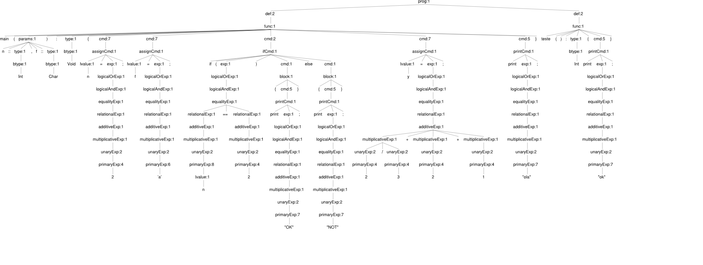

# Relatório de Projeto: Analisador Sintático

**Autores:** Igor Carvalho Guimarães, Rafael Henrique Suzuki

## 1. Decisões de Projeto

O grupo optou por escolher a ferramenta ANTLR4 devido à simplicidade no momento de criar o lexer e o parser, além de maior referência disponível online.

Todos os testes executados foram realizados em servidor Linux na arquitetura ARM, juntamente com testes automatizados em arquitetura AMD.

### 1.1 Escolha de Ferramentas

- Ferramenta principal: ANTLR4 (ANother Tool for Language Recognition)

### 1.2 Descrição das Ferramentas Utilizadas

**ANTLR4:** É um poderoso gerador de analisadores sintáticos que pode ser usado para ler, processar, executar ou traduzir texto estruturado ou arquivos binários. É amplamente utilizado para construir linguagens, ferramentas e frameworks.

### 1.3 Estratégia de Implementação do Analisador Sintático

- Método: LL(*)
- Separação entre léxico e sintático: Sim

O ANTLR4 utiliza o algoritmo LL(*), uma variação do LL(k) que permite uma análise mais eficiente e flexível. A separação entre análise léxica e sintática é mantida, com o ANTLR gerando um lexer e um parser separados.

### 1.4 Estratégia de Interpretação

O grupo não teve sucesso na implementação da interpretação, porém chegou a testar o modelo visitor do próprio ANTLR. Também foram testados JCUP e Beaver na análise sintática, porém o ANTLR foi o que obteve maior sucesso.

### 1.5 Representação da Árvore de Sintaxe Abstrata (AST)

## 2. Conclusão

Neste projeto, conseguimos implementar com sucesso um analisador sintático utilizando a ferramenta ANTLR4. A escolha desta ferramenta provou-se acertada devido à sua facilidade de uso na criação do lexer e parser, bem como à abundância de recursos disponíveis online.

Alcançamos os seguintes objetivos:

1. Implementação bem-sucedida do analisador léxico e sintático.
2. Geração da Árvore de Sintaxe Abstrata (AST) para os arquivos de entrada.
3. Realização de testes abrangentes em diferentes arquiteturas (ARM e AMD).

Embora não tenhamos conseguido implementar a análise semântica e a interpretação nesta fase do projeto, estes desafios nos proporcionaram valiosas lições e insights. Exploramos diferentes abordagens, incluindo o modelo visitor do ANTLR e outras ferramentas como JCUP e Beaver, o que ampliou nossa compreensão das complexidades envolvidas na análise e interpretação de linguagens.

Para a próxima fase do projeto, nos comprometemos a:

1. Implementar a análise semântica.
2. Desenvolver a interpretação completa da linguagem.
3. Refinar e otimizar o analisador sintático existente.

Este projeto tem sido uma excelente oportunidade de aprendizado, permitindo-nos aplicar conceitos teóricos em um cenário prático de desenvolvimento de compiladores. Estamos ansiosos para superar os desafios remanescentes e entregar um analisador completo e funcional na próxima etapa do trabalho.
